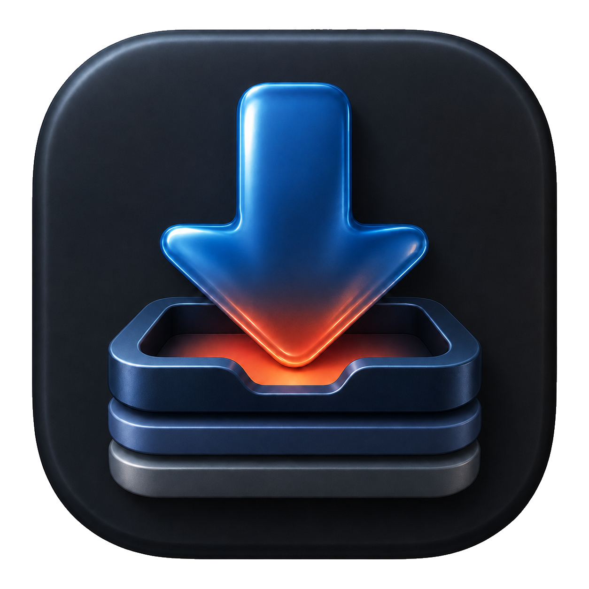

<p align="center">
  
</p>

<h1 align="center">Pullr</h1>

<p align="center">
  <a href="https://italian-seasoning.github.io/Pullr/">Website</a> ·
  <a href="https://github.com/Italian-seasoning/Pullr/releases/latest">Latest preview</a> ·
  <a href="PRIVACY.md">Privacy</a>
</p>

Pullr is a native macOS download queue for media you own, have permission to save, or can legally access offline. It supports individual links, playlists, direct HLS streams, audio import into Apple Music, and an optional Chrome extension.

## Requirements

- macOS 14 or newer
- [`yt-dlp`](https://github.com/yt-dlp/yt-dlp)
- [`ffmpeg`](https://ffmpeg.org/)
- [`Deno`](https://deno.com/) for YouTube challenge handling

Install the command-line dependencies with Homebrew:

```sh
brew install yt-dlp ffmpeg deno
```

## Install

Download the latest DMG from [Releases](https://github.com/Italian-seasoning/Pullr/releases). It contains Pullr.app and an `Install Pullr.command` helper; double-click the helper for a one-step install. Current preview builds are Sparkle-signed but not Apple-notarized, so Control-click Pullr and choose **Open** the first time.

## Chrome extension

1. Open `chrome://extensions` and enable Developer mode.
2. Choose **Load unpacked** and select `chrome-extension` from this repository.
3. Run `./native-host/install.sh` from Terminal.
4. Reload the extension after updating its files.

The extension can send supported pages to Pullr and match YouTube tracks in Apple Music. Website and YouTube hours tracking is optional and off by default; enable it from the extension popup.

## Build and test

```sh
./script/run_unit_tests.sh
python3 native-host/test_native_host.py
node chrome-extension/test_music_tracker.js
node chrome-extension/test_page_capture.js
node chrome-extension/test_stream_capture.js
node chrome-extension/test_website_tracker.js
./script/build_and_run.sh --verify
```

Sparkle is pinned through Swift Package Manager. Release archives and appcasts are signed with a private key stored in the maintainer's macOS Keychain; the private key is never stored in this repository.

## Privacy and diagnostics

Pullr has no analytics or accounts. The developer does not receive activity data. Settings, queue state, optional local activity history, and diagnostics remain in `~/Library/Application Support/Pullr`. Diagnostic logs remove URL query strings and replace the home-directory prefix before writing. The Chrome native host records only timestamps, action names, outcomes, and safe error types.

Network access is limited to the links you request, Apple catalog matching, dependency updates you initiate, and GitHub Releases for Sparkle update checks.

Pullr does not decrypt DRM, bypass access controls, or automatically copy browser cookies. You are responsible for complying with site terms and applicable law.

See [Privacy](PRIVACY.md) and [Terms of Use](TERMS.md).
